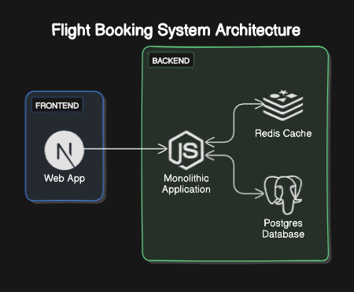
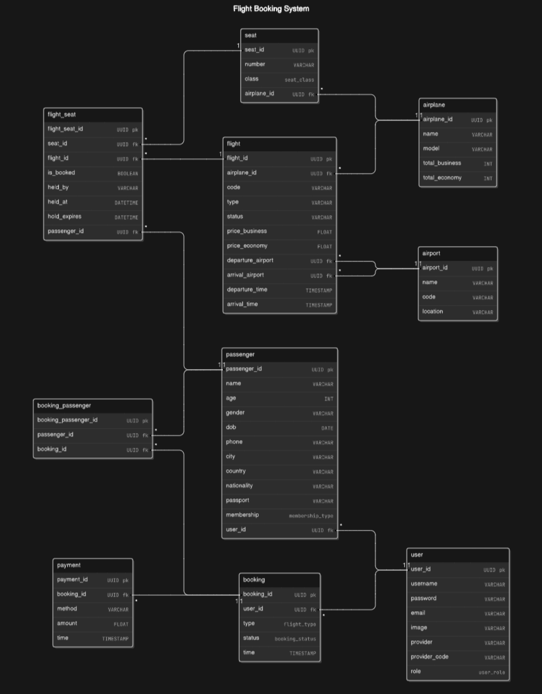

# AirZkare

## Overview
1. AirZkare is a user-friendly web platform designed to simplify the process of booking flights. Users can easily search for and book flights, select their preferred seats, make secure online payments, and receive email confirmations for their bookings. The platform also provides robust management tools for administrators, allowing them to oversee flights, airlines, airports, users, and ticket prices. AirZkare aims to deliver a seamless, efficient experience for both travelers and administrators.

    **If you want to test admin features, use the following credentials:**

    - **Email:** `admin@gmail.com`  
    - **Password:** `admin`

2. Technology
    - Next.js
    - Express.js
    - Redis
    - PostgreSQL
    - Prisma ORM
    - TailwindCSS
    - Socket.io
    - Docker

3. Website: [https://air-zkare.vercel.app]

## Architecture:

## ERD:

## Features:

1. **User:**
    - Login / Register with JWT, Google OAuth
    - View / Edit Profile
    - Find a flight
    - Book / Cancel a flight
    - Real-time in-flight seat selection with seat lock functionality using WebSocket and Cronjob: When a user selects a seat, it will be temporarily locked, preventing other users on the same page from selecting it until the lock is released
    - Payment Gateway Stripe and QR code with Zalopay
    - Get notification email confirm about booking via NodeMailer
    - View booking history
    - View current flight status

2. **Admin:**
    - Manage flight schedule
    - Manage seat availability
    - Manage user
    - Manage airplanes
    - Manage airport that flight go through
    - Dashboard with flight and booking analytics
    
